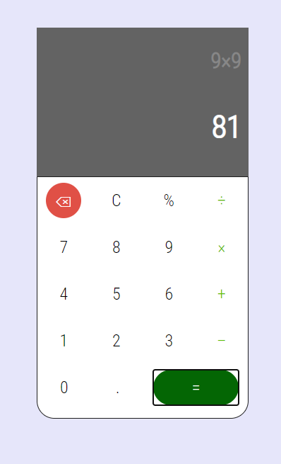

# Project: Weather App

 This is a practice project for building a simple calculator app. The app can perform simple calculations like addition, subtraction, multiplication, division. It can also clear items once entered and also works with decimals.

## Built With

- HTML
- CSS
- Javascript
- Webpack

## Live Version

[Live Link](https://emmanuelkamala.github.io/Simple_CalculatorJs/)

## Getting Started

Open your terminal or text editor and use next command

  git clone https://github.com/emmanuelkamala/Simple_CalculatorJs.git

  cd WeatherApp

  Run: 'npm install', to install all the dependencies

  Run: 'npm run dev', to compile the files, and start localserver

  visit: localhost:8080 on the browser

After if you want to do any changes please create new branch, after changes open pull request.
Happy coding! 

## Authors

👤 **Author1**

- Github: [emmanuelkamala](https://github.com/emmanuelkamala)
- Twitter: [ejkamala](https://twitter.com/ejkamala)
- Linkedin: [emmanuelkamala](https://linkedin.com/in/emmanuelkamala)

## 🤝 Contributing

Contributions, issues and feature requests are welcome!

Feel free to check the [issues page](issues/).

## Show your support

Give a ⭐️ if you like this project!

## Acknowledgments

- The odin project
- Bootstrap free framework
- Microverse tips

## 📝 License

This project is [MIT](lic.url) licensed.